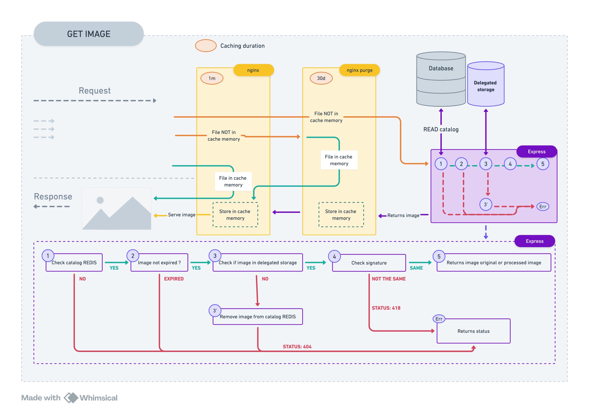
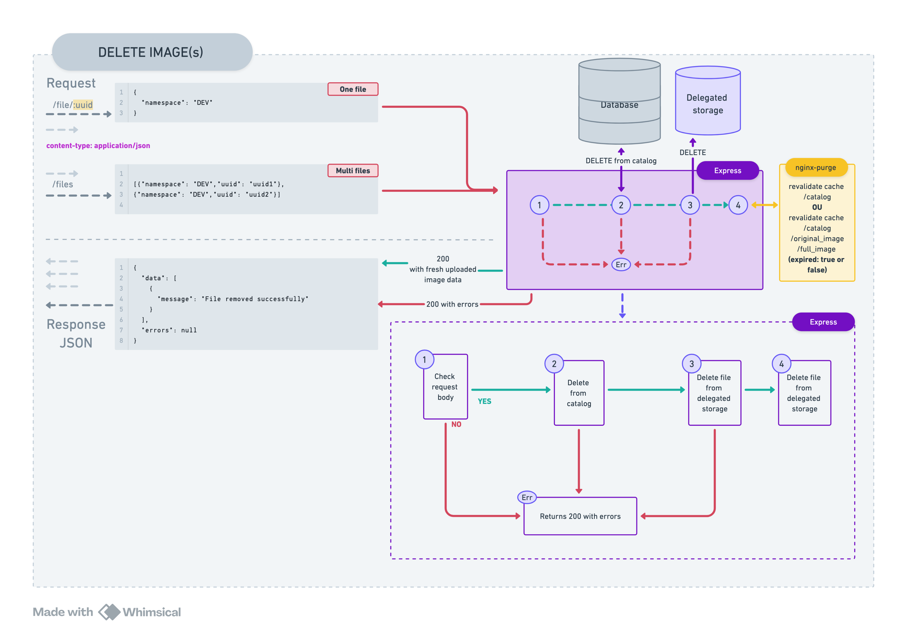

<a id="readme-top"></a>

# Transform And Deliver Assets - TADA 🎉

<details>
  <summary>Table of Contents</summary>
  <ol>
    <li>
      <a href="#discover-TADA">Discover TADA 🎉</a>
      <ul>
        <li><a href="#context">Context </a></li>
        <li><a href="#project-structure-and-architecture">Project structure and architecture 🚧</a></li>   
        <li><a href="#global-flow-architecture">Global flow architecture</a></li>  
        <li><a href="#use-cases">Use cases</a></li>  
        <li><a href="#catalog">Catalog</a></li>  
        <li><a href="#daily-jobs">Daily jobs</a></li>  
    </ul>
    </li>
    <li>
      <a href="#getting-started">Getting Started</a>
      <ul>
        <li><a href="#prerequisites">Prerequisites</a></li>
        <li><a href="#installation">Installation</a></li>
      </ul>
    </li>
    <li><a href="#usage">Usage</a></li>
    <li><a href="#roadmap">Roadmap</a></li>
    <li><a href="#contributing">Contributing</a></li>
    <li><a href="#license">License</a></li>
    <li><a href="#contact">Contact</a></li>
    <li><a href="#acknowledgments">Acknowledgments</a></li>
  </ol>
</details>

## Discover TADA

### Context

The image service allows any utils service to send files to be publicly hosted. Through an utils interface, such as
Directus for example, a user can utils an image and obtain a public URL to use to access their file.
The user can either use the original image via a specific URL or process the image for optimization.

### Project structure and architecture

The image service (more generally files) consists of a first Nginx server whose configuration contains 3 types of locations:

- /catalog
- /assets/media/\*
- /purge/assets/media/\*

This first web server is caching resource 1m,
then proxy pass to the nginx purge server that contains the same locations but configured with proxy_purge_module.
This server caching 30d and can invalidate cache with purge location.

To retrieve an uploaded file, 3 ways :

- /assets/media/**original**/`image_name.extension` : no processing on the image
- /assets/media/**full**/`image_name.extension` : transform to webp and serve as webp
- /assets/media/**optimise**/200x0/`image_name.extension` : resizing to with 200 and transform to webp and serve as webp

And finally an Express Node API whose roles are:

- providing the list of files exposed by the catalog/reference on a GET route
- uploading new files
- updating existing files

An important point is also the notion of catalog. The catalog serves as a reference & truth for the express API, containing information indicating not to serve it (either it has been deleted from the catalog, or it has expired for example).

### Global flow architecture


### Use cases






### Catalog

To track the images that we have uploaded/deleted/updated we use a Redis server and serve catalog list to json format. Here's a glimpse of it's
structure:

```json
[
    {
        "uuid": "e080a953-5300-427b-bd39-6e235d8238a2",
        "version": 1,
        "namespace": "DEV",
        "public_url": "http://localhost:8080/palpatine/assets/media/full/image/DEV/default.webp",
        "unique_name": "/DEV/default.webp",
        "filename": "default.webp",
        "original_filename": "default.webp",
        "base_url": "http://localhost:8080/palpatine/assets/media",
        "external_id": null,
        "expired": false,
        "expiration_date": null,
        "information": null,
        "original_mimetype": "image/webp",
        "mimetype": "image/webp",
        "signature": "ca71754acda70e41cb23e465fbb5ecc683186cf779a2bae2cbf290527b1f6671",
        "size": 16730
    },
    {
        "uuid": "d26a191f-1087-4169-b6cd-3db96f38ece4",
        "version": 1,
        "namespace": "DEV",
        "public_url": "http://localhost:8080/palpatine/assets/media/full/image/DEV/error.webp",
        "unique_name": "/DEV/error.webp",
        "filename": "error.webp",
        "original_filename": "error.webp",
        "base_url": "http://localhost:8080/palpatine/assets/media",
        "external_id": null,
        "expired": false,
        "expiration_date": null,
        "information": null,
        "original_mimetype": "image/webp",
        "mimetype": "image/webp",
        "signature": "368ba95afb311edfe0cb7f3b4a221e8b2a3edeb4e16fc5683762791f9619b28a",
        "size": 10614
    }
]
```

### Daily jobs

2 daily jobs associated with TADA (Transform And Deliver Assets 🎉):

- a job to synchronize the state of our API in relation to YOUR delegated_storage: if the image is in the catalog, but not in your storage, it deletes the image from the catalog.
- a catalog publication job on your delegated storage: the status of the catalog once a day is published on your storage which allows you to retrieve the most up-to-date list in the event of a new API instance.

## How to use TADA ? 🎉

### Using Chart Helm dependencie :

```yaml
apiVersion: v2
name: chart
description: A Helm chart for Kubernetes

type: application
version: 0.1.0

appVersion: '0.0.1'
dependencies:
    - name: transform-and-deliver-assets
      version: latest
      repository: oci://registry-1.docker.io/bouyguestelecomcharts/tada
```

All releases :
https://hub.docker.com/r/bouyguestelecom/tada/tags

### CHANGE VALUES / CUSTOMIZE SERVICES

```yaml
transform-and-deliver-assets:
    local: true
    redis: ...
    delegatedStorage: ...
    s3: ...
    mediaProvider: ...
    rateLimit: ...
    domain: .media
    env: media-service
    # SEE BELOW ALL VALUES
```

| Clé                                              | Description                                         | Exemples de Valeurs       |
| ------------------------------------------------ | --------------------------------------------------- | ------------------------- |
| local                                            | Activer ou désactiver le mode local                 | true / false              |
| redis.service                                    | Nom du service Redis                                | 'redis-service'           |
| redis.dumpFolderPath                             | Chemin du dossier de dump pour Redis                | '/dumps'                  |
| redis.storage.storageClassName                   | Nom de la classe de stockage pour Redis             | 'hostpath'                |
| redis.storage.resources.requests.storage         | Espace de stockage demandé par Redis                | '500Mi'                   |
| delegatedStorage.rateLimitWindow                 | Fenêtre de limitation de débit (ms)                 | 30000                     |
| delegatedStorage.rateLimit                       | Limitation de débit                                 | 5                         |
| delegatedStorage.host                            | Nom d'hôte du service personnalisé                  | 'your_custom_service_api' |
| delegatedStorage.routes.readinessCheck           | Chemin de vérification de disponibilité             | '/readiness-check'        |
| delegatedStorage.accessToken                     | Jeton d'accès pour le stockage délégué              | 'your_access_token'       |
| delegatedStorage.storageMethod                   | Méthode de stockage                                 | 'DISTANT_BACKEND'         |
| s3.routes.readinessCheck                         | Chemin de vérification de disponibilité pour MinIO  | '/minio/health/live'      |
| s3.endpoint                                      | Point de terminaison (endpoint) pour S3/MinIO       | 'minio'                   |
| s3.port                                          | Port pour S3/MinIO                                  | '9000'                    |
| s3.accessKey                                     | Clé d'accès pour S3/MinIO                           | 'minioadmin'              |
| s3.secretKey                                     | Clé secrète pour S3/MinIO                           | 'minioadmin'              |
| s3.bucketName                                    | Nom du bucket S3/MinIO                              | 'media'                   |
| s3.storage.storageClassName                      | Nom de la classe de stockage pour S3/MinIO          | 'hostpath'                |
| s3.storage.resources.requests.storage            | Espace de stockage demandé pour S3/MinIO            | '500Mi'                   |
| mediaProvider.service                            | URL du service média                                | 'http://media-service'    |
| mediaProvider.apiPrefix                          | Préfixe de l'API pour le service média              | '/palpatine'              |
| mediaProvider.routes.healthcheck.get             | Chemin de vérification de la santé du service média | '/readiness-check'        |
| mediaProvider.routes.file.get                    | Chemin GET pour récupérer des fichiers              | '/assets/media/'          |
| mediaProvider.routes.file.post                   | Chemin POST pour télécharger un fichier             | '/upload'                 |
| mediaProvider.routes.files.post                  | Chemin POST pour télécharger plusieurs fichiers     | '/uploads'                |
| mediaProvider.routes.catalog.get                 | Chemin GET pour récupérer le catalogue de fichiers  | '/catalog'                |
| mediaProvider.payloadMaxSize                     | Taille maximale de la charge utile                  | '10mb'                    |
| mediaProvider.rateLimit.windowMs                 | Fenêtre de limitation de débit (ms)                 | 30000                     |
| mediaProvider.rateLimit.limit                    | Limitation de débit                                 | 5                         |
| mediaProvider.originsAllowed                     | Origines autorisées                                 | 'localhost,\*'            |
| mediaProvider.methodsAllowed                     | Méthodes HTTP autorisées                            | 'GET,POST'                |
| mediaProvider.storage.storageClassName           | Nom de la classe de stockage pour le provider média | 'hostpath'                |
| mediaProvider.storage.resources.requests.storage | Espace de stockage demandé pour le media provider   | '500Mi'                   |
| rateLimit.windowMs                               | Fenêtre de limitation de débit (ms)                 | 30000                     |
| rateLimit.limit                                  | Limitation de débit                                 | 5                         |
| domain                                           | Domaine du service                                  | '.media'                  |
| env                                              | Environnement du service                            | 'media-service'           |
| NAMESPACES_ALLOWED                               | Espaces de noms autorisés                           | 'DEV'                     |
| version                                          | Version du chart                                    | '1.0.6'                   |

### Using docker image API :

You can use our docker image API from [docker hub](https://hub.docker.com/r/bouyguestelecom/tada/tags)

```shell
 docker pull bouyguestelecom/tada:api-latest
```

## Want to collaborate or test locally ?

### Prerequisites

- docker
- kubernetes

### Installation

#### With Make and kubernetes dashboard

Prerequisites :

- Make installed
- Docker
- Kubernetes

1. Launch Makefile
    ```sh
    make start
    ```
2. Stop services
    ```sh
    make stop
    ```

#### With Helm

Prerequisites :

- Helm installed
- Docker
- Kubernetes

1. Helm install
    ```sh
    helm upgrade --install media-release opensource/. -f opensource/values.local.yaml
    ```
2. Helm uninstall
    ```sh
    helm uninstall media-release
    ```

#### With Docker Compose

Prerequisites :

- Docker compose
- Docker

1. Build and run services (image docker api from [docker hub](https://hub.docker.com/r/bouyguestelecom/tada/tags))
    ```sh
    docker compose up --build -d
    ```
2. Build and run services locally
    ```sh
    docker compose -f docker-compose.dev.yml up --build -d
    ```
3. Stop services
    ```sh
    docker compose down
    ```

#### To test locally without docker :

Prerequisites:

- npm
- node

2. Install NPM packages
    ```sh
    npm install --prefix src/api/
    ```
3. Run api
    ```sh
    npm run dev:api
    ```

<p align="right">(<a href="#readme-top">back to top</a>)</p>

<!-- USAGE EXAMPLES -->

## Usage

Use this space to show useful examples of how a project can be used.

_For more examples, please refer to the [Documentation](https://example.com)_

<p align="right">(<a href="#readme-top">back to top</a>)</p>

<!-- ROADMAP -->

## Roadmap

- [x] Add Changelog
- [x] Add waza
- [ ] Add waza 2

See the [open issues]() for a full list of proposed features (and known issues).

<p align="right">(<a href="#readme-top">back to top</a>)</p>

<!-- CONTRIBUTING -->

## Contributing

Contributions are what make the open source community such an amazing place to learn, inspire, and create. Any contributions you make are **greatly appreciated**.

If you have a suggestion that would make this better, please fork the repo and create a pull request. You can also simply open an issue with the tag "enhancement".
Don't forget to give the project a star! Thanks again!

1. Fork the Project
2. Create your Feature Branch (`git checkout -b feature/AmazingFeature`)
3. Commit your Changes (`git commit -m 'Add some AmazingFeature'`)
4. Push to the Branch (`git push origin feature/AmazingFeature`)
5. Open a Pull Request

<p align="right">(<a href="#readme-top">back to top</a>)</p>

<!-- LICENSE -->

## License

Distributed under the MIT License. See `LICENSE.txt` for more information.

<p align="right">(<a href="#readme-top">back to top</a>)</p>

<!-- CONTACT -->

## Contact

Maintainer name - email@example.com

Project Link: [https://github.com/](https://github.com/)

<p align="right">(<a href="#readme-top">back to top</a>)</p>

<!-- ACKNOWLEDGMENTS -->

## Acknowledgments

Use this space to list resources you find helpful and would like to give credit to. I've included a few of my favorites to kick things off!

- [Choose an Open Source License](https://choosealicense.com)
- [GitHub Emoji Cheat Sheet](https://www.webpagefx.com/tools/emoji-cheat-sheet)
- [Malven's Flexbox Cheatsheet](https://flexbox.malven.co/)
- [Malven's Grid Cheatsheet](https://grid.malven.co/)
- [Img Shields](https://shields.io)
- [GitHub Pages](https://pages.github.com)
- [Font Awesome](https://fontawesome.com)
- [React Icons](https://react-icons.github.io/react-icons/search)

<p align="right">(<a href="#readme-top">back to top</a>)</p>
