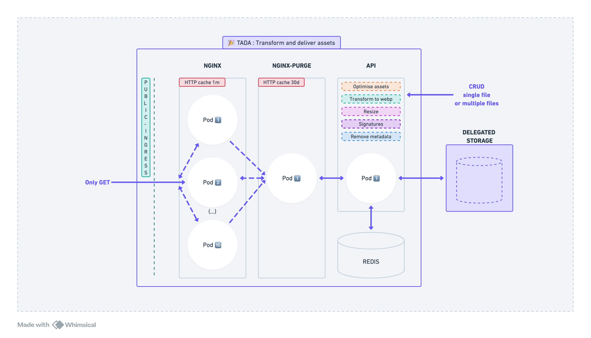
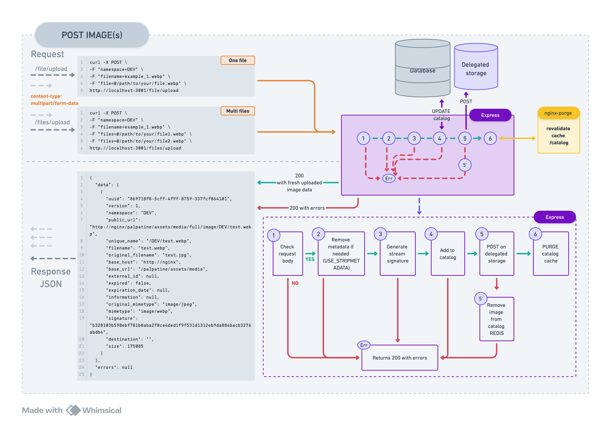

<a id="readme-top"></a>

# Transform And Deliver Assets - TADA 🎉

<details>
  <summary>Table of Contents</summary>
  <ol>
    <li>
      <a href="#discover-TADA">Discover TADA 🎉</a>
      <ul>
        <li><a href="#context">Context </a></li>
        <li><a href="#project-structure-and-architecture">Project structure and architecture 🚧</a></li>   
        <li><a href="#global-flow-architecture">Global flow architecture</a></li>  
        <li><a href="#use-cases">Use cases</a></li>  
        <li><a href="#catalog">Catalog</a></li>  
        <li><a href="#daily-jobs">Daily jobs</a></li>
        <li><a href="#catalog-dump-system">Catalog Dump System</a></li>  
    </ul>
    </li>
    <li>
      <a href="#getting-started">Getting Started</a>
      <ul>
        <li><a href="#prerequisites">Prerequisites</a></li>
        <li><a href="#installation">Installation</a></li>
      </ul>
    </li>
    <li><a href="#usage">Usage</a></li>
    <li><a href="#roadmap">Roadmap</a></li>
    <li><a href="#contributing">Contributing</a></li>
    <li><a href="#license">License</a></li>
    <li><a href="#contact">Contact</a></li>
    <li><a href="#acknowledgments">Acknowledgments</a></li>
  </ol>
</details>

## Discover TADA

### Context

The image service allows any utils service to send files to be publicly hosted. Through an utils interface, such as
Directus for example, a user can utils an image and obtain a public URL to use to access their file.
The user can either use the original image via a specific URL or process the image for optimization.

### Project structure and architecture

The image service (more generally files) consists of a first Nginx server whose configuration contains 3 types of locations:

- /catalog
- /assets/media/\*
- /purge/assets/media/\*

This first web server is caching resource 1m,
then proxy pass to the nginx purge server that contains the same locations but configured with proxy_purge_module.
This server caching 30d and can invalidate cache with purge location.

To retrieve an uploaded file, 3 ways :

- /assets/media/**original**/`image_name.extension` : no processing on the image
- /assets/media/**full**/`image_name.extension` : transform to webp and serve as webp
- /assets/media/**optimise**/200x0/`image_name.extension` : resizing to with 200 and transform to webp and serve as webp

And finally an Express Node API whose roles are:

- providing the list of files exposed by the catalog/reference on a GET route
- uploading new files
- updating existing files

An important point is also the notion of catalog. The catalog serves as a reference & truth for the express API, containing information indicating not to serve it (either it has been deleted from the catalog, or it has expired for example).

### Global flow architecture



### Use cases





### Catalog

To track the images that we have uploaded/deleted/updated we use a Redis server and serve catalog list to json format. Here's a glimpse of it's
structure:

```json
[
    {
        "uuid": "e080a953-5300-427b-bd39-6e235d8238a2",
        "version": 1,
        "namespace": "DEV",
        "public_url": "http://localhost:8080/prefix/assets/media/full/image/DEV/default.webp",
        "unique_name": "/DEV/default.webp",
        "filename": "default.webp",
        "original_filename": "default.webp",
        "base_url": "http://localhost:8080/prefix/assets/media",
        "external_id": null,
        "expired": false,
        "expiration_date": null,
        "information": null,
        "original_mimetype": "image/webp",
        "mimetype": "image/webp",
        "signature": "ca71754acda70e41cb23e465fbb5ecc683186cf779a2bae2cbf290527b1f6671",
        "size": 16730,
        "destination": "DEV",
        "uploaded_date": "2025-06-05T10:29:17.029+02:00",
        "updated_date": "2025-06-05T10:29:17.030+02:00"
    },
    {
        "uuid": "d26a191f-1087-4169-b6cd-3db96f38ece4",
        "version": 1,
        "namespace": "DEV",
        "public_url": "http://localhost:8080/prefix/assets/media/full/image/DEV/error.webp",
        "unique_name": "/DEV/error.webp",
        "filename": "error.webp",
        "original_filename": "error.webp",
        "base_url": "http://localhost:8080/prefix/assets/media",
        "external_id": null,
        "expired": false,
        "expiration_date": null,
        "information": null,
        "original_mimetype": "image/webp",
        "mimetype": "image/webp",
        "signature": "368ba95afb311edfe0cb7f3b4a221e8b2a3edeb4e16fc5683762791f9619b28a",
        "size": 10614,
        "uploaded_date": "2025-06-05T10:29:17.029+02:00",
        "updated_date": "2025-06-05T10:29:17.030+02:00"
    }
]
```

### Daily jobs

3 daily jobs associated with TADA (Transform And Deliver Assets 🎉):

- a job to synchronize the state of our API in relation to YOUR delegated_storage: if the image is in the catalog, but not in your storage, it deletes the image from the catalog.
- a catalog publication job on your delegated storage: the status of the catalog once a day is published on your storage which allows you to retrieve the most up-to-date list in the event of a new API instance.
- a job to check the expiration of the files in the catalog with an expiration date.

### Catalog Dump System

TADA provides a comprehensive dump system for backing up and restoring catalog data. This system supports both **JSON** and **RDB** formats for maximum flexibility and compatibility.

#### Key Features

- **📤 Dual Format Creation**: Automatically generates both JSON and RDB dumps
- **📥 Smart Restoration**: Prioritizes JSON format with RDB fallback
- **🔄 No Container Restart**: JSON restoration works without Redis restarts
- **🌐 Distant Backend Support**: Full integration with external storage services
- **⚡ Atomic Operations**: All-or-nothing approach for data consistency

#### API Endpoints

| Method | Endpoint | Description |
|--------|----------|-------------|
| `POST` | `/catalog/create-dump` | Creates dual-format dump (JSON + RDB) |
| `GET` | `/catalog/get-dump/:filename` | Retrieves specific dump file |
| `GET` | `/catalog/get-dump/latest?format=json` | Gets latest JSON dump |
| `POST` | `/catalog/restore-dump` | Restores catalog from dump |

#### Usage Examples

##### Creating a Dump

```bash
# Create both JSON and RDB dumps simultaneously
curl -X POST http://localhost:3001/catalog/create-dump \
  -H "Content-Type: application/json"

# Response includes both formats
{
  "message": "Dump files created and uploaded successfully",
  "files": {
    "json": {
      "filename": "dump_20250812T143052.json",
      "size": 2456,
      "records": 15
    },
    "rdb": {
      "filename": "dump_20250812T143052.rdb", 
      "size": 1104
    }
  },
  "timestamp": "20250812T143052"
}
```

##### Retrieving a Dump

```bash
# Get latest JSON dump (recommended for restore)
curl "http://localhost:3001/catalog/get-dump/latest?format=json" \
  --output catalog-backup.json

# Get specific RDB dump
curl "http://localhost:3001/catalog/get-dump/dump_20250812T143052.rdb" \
  --output redis-backup.rdb

# Get latest available (any format)
curl "http://localhost:3001/catalog/get-dump/latest"
```

##### Restoring from Dump

```bash
# Restore from latest JSON dump (automatic cleanup + reload)
curl -X POST http://localhost:3001/catalog/restore-dump \
  -H "Content-Type: application/json"

# Restore from specific file
curl -X POST "http://localhost:3001/catalog/restore-dump?filename=dump_20250812T143052.json" \
  -H "Content-Type: application/json"

# Response
{
  "message": "Successfully restored catalog from JSON dump",
  "details": {
    "filename": "dump_20250812T143052.json",
    "itemsRestored": 15,
    "format": "JSON",
    "source": "distant_backend"
  }
}
```

#### File Format

Dumps follow a timestamp-based naming convention:

```
dump_YYYYMMDDTHHMMSS.json  # JSON format (human-readable)
dump_YYYYMMDDTHHMMSS.rdb   # RDB format (Redis binary)

# Examples:
dump_20250812T143052.json
dump_20250812T143052.rdb
```

#### Configuration for Distant Backend

When using `DELEGATED_STORAGE_METHOD=DISTANT_BACKEND`, configure these environment variables:

```bash
# Required environment variables
DELEGATED_STORAGE_METHOD=DISTANT_BACKEND
DELEGATED_STORAGE_HOST=http://your-backend-service
DELEGATED_STORAGE_TOKEN=your-access-token

# Optional
DUMP_FOLDER_PATH=/dumps  # Local RDB storage path
```

#### Restoration Process

The restore operation follows these steps:

1. **🧹 Clear Cache**: Flushes all existing Redis keys
2. **📥 Fetch Dump**: Retrieves JSON dump from storage
3. **✅ Validate**: Ensures data integrity and format
4. **📝 Load Data**: Restores catalog items to Redis
5. **🔄 Reinitialize**: Refreshes cache and connections

#### Storage Methods

##### Local Storage
```bash
# Default local storage in /dumps folder
DELEGATED_STORAGE_METHOD=""
DUMP_FOLDER_PATH="/dumps"
```

##### S3 Compatible
```bash
# S3 or MinIO storage
DELEGATED_STORAGE_METHOD="S3"
S3_ENDPOINT="minio"
S3_BUCKET_NAME="media"
```

##### Distant Backend
```bash
# External service integration
DELEGATED_STORAGE_METHOD="DISTANT_BACKEND"  
DELEGATED_STORAGE_HOST="http://palpatine-media"
DELEGATED_STORAGE_TOKEN="your-token"
```

#### Workflow Architecture


#### Best Practices

##### For Production

- **✅ Use JSON format** for restoration (more reliable than RDB)
- **✅ Automated backups** via cron or scheduled tasks  
- **✅ Test restoration** regularly in non-production environments
- **✅ Monitor storage usage** and implement cleanup policies
- **✅ Validate dumps** before critical restore operations

##### For Development

```bash
# Quick backup before major changes
curl -X POST http://localhost:3001/catalog/create-dump

# Quick restore after testing
curl -X POST http://localhost:3001/catalog/restore-dump
```

##### Error Handling

The system provides detailed error messages and suggestions:

```json
{
  "error": "JSON dump file not found",
  "details": "No JSON dump file found for latest in distant backend",
  "suggestion": "Try requesting the other format or create a new dump with both formats"
}
```

This dump system ensures your catalog data is always safe, portable, and recoverable across different TADA deployments and storage backends.

## How to use TADA ? 🎉

### Using Chart Helm dependencie :

```yaml
apiVersion: v2
name: chart
description: A Helm chart for Kubernetes

type: application
version: 0.1.0

appVersion: '0.0.1'
dependencies:
    - name: transform-and-deliver-assets
      version: latest
      repository: oci://registry-1.docker.io/bouyguestelecomcharts/tada
```

All releases :
https://hub.docker.com/r/bouyguestelecom/tada/tags

### CHANGE VALUES / CUSTOMIZE SERVICES

```yaml
transform-and-deliver-assets:
    local: true
    redis: ...
    delegatedStorage: ...
    s3: ...
    mediaApi: ...
    rateLimit: ...
    domain: .media
    env: media-service
    # SEE BELOW ALL VALUES
```

| Clé                                         | Description                                | Exemples de Valeurs       |
| ------------------------------------------- | ------------------------------------------ | ------------------------- |
| local                                       | Enable or disable the local mode           | true / false              |
| redis.service                               | Redis service name                         | 'redis-service'           |
| redis.dumpFolderPath                        | Redis dump folder path                     | '/dumps'                  |
| redis.storage.storageClassName              | Redis storage class name                   | 'hostpath'                |
| redis.storage.resources.requests.storage    | Redis storage requested space              | '500Mi'                   |
| delegatedStorage.rateLimitWindow            | Delegated storage rate limit window (ms)   | 30000                     |
| delegatedStorage.rateLimit                  | Delegated storage rate limit               | 5                         |
| delegatedStorage.host                       | Custom service API host                    | 'your_custom_service_api' |
| delegatedStorage.routes.readinessCheck      | Readiness check path                       | '/readiness-check'        |
| delegatedStorage.accessToken                | Access token for the delegated storage     | 'your_access_token'       |
| delegatedStorage.storageMethod              | Storage method                             | 'DISTANT_BACKEND'         |
| s3.routes.readinessCheck                    | Readiness check path for MinIO             | '/minio/health/live'      |
| s3.endpoint                                 | Endpoint for S3/MinIO                      | 'minio'                   |
| s3.port                                     | Port for S3/MinIO                          | '9000'                    |
| s3.accessKey                                | Access key for S3/MinIO                    | 'minioadmin'              |
| s3.secretKey                                | Secret key for S3/MinIO                    | 'minioadmin'              |
| s3.bucketName                               | Bucket name for S3/MinIO                   | 'media'                   |
| s3.storage.storageClassName                 | Storage class name for S3/MinIO            | 'hostpath'                |
| s3.storage.resources.requests.storage       | Requested storage space for S3/MinIO       | '500Mi'                   |
| mediaApi.service                            | URL for the media service                  | 'http://media-service'    |
| mediaApi.apiPrefix                          | API prefix for the media service           | '/prefix'              |
| mediaApi.routes.healthcheck.get             | Media healthcheck endpoint                 | '/readiness-check'        |
| mediaApi.routes.file.get                    | Endpoint to get files                      | '/assets/media/'          |
| mediaApi.routes.file.post                   | Endpoint to upload a file                  | '/upload'                 |
| mediaApi.routes.files.post                  | Endpoint to upload multiple files          | '/uploads'                |
| mediaApi.routes.catalog.get                 | Endpoint to get the file catalog           | '/catalog'                |
| mediaApi.payloadMaxSize                     | Maximum payload size                       | '10mb'                    |
| mediaApi.rateLimit.windowMs                 | Rate limit window (ms)                     | 30000                     |
| mediaApi.rateLimit.limit                    | Rate limit                                 | 5                         |
| mediaApi.originsAllowed                     | Allowed origins                            | 'localhost,\*'            |
| mediaApi.methodsAllowed                     | Allowed HTTP methods                       | 'GET,POST'                |
| mediaApi.storage.storageClassName           | Storage class name for media provider      | 'hostpath'                |
| mediaApi.storage.resources.requests.storage | Requested storage space for media provider | '500Mi'                   |
| rateLimit.windowMs                          | Rate limit window (ms)                     | 30000                     |
| rateLimit.limit                             | Rate limit                                 | 5                         |
| domain                                      | Domain for the service                     | '.media'                  |
| env                                         | Environment for the service                | 'media-service'           |
| NAMESPACES_ALLOWED                          | Allowed namespaces                         | 'DEV'                     |
| version                                     | Chart version                              | '1.0.6'                   |

### Using docker image API :

You can use our docker image API from [docker hub](https://hub.docker.com/r/bouyguestelecom/tada/tags)

```shell
 docker pull bouyguestelecom/tada:api-latest
```

## Want to collaborate or test locally ?

### Prerequisites

- docker
- kubernetes

### Installation

#### With Make and kubernetes dashboard

Prerequisites :

- Make installed
- Docker
- Kubernetes

1. Launch Makefile
    ```sh
    make start
    ```
2. Stop services
    ```sh
    make stop
    ```

#### With Helm

Prerequisites :

- Helm installed
- Docker
- Kubernetes

1. Helm install
    ```sh
    helm upgrade --install media-release opensource/. -f opensource/values.local.yaml
    ```
2. Helm uninstall
    ```sh
    helm uninstall media-release
    ```

#### With Docker Compose

Prerequisites :

- Docker compose
- Docker

1. Build and run services (image docker api from [docker hub](https://hub.docker.com/r/bouyguestelecom/tada/tags))
    ```sh
    docker compose up --build -d
    ```
2. Build and run services locally
    ```sh
    docker compose -f docker-compose.dev.yml up --build -d
    ```
3. Stop services
    ```sh
    docker compose down
    ```

#### To test locally without docker :

Prerequisites:

- npm
- node

2. Install NPM packages
    ```sh
    npm install --prefix src/api/
    ```
3. Run api
    ```sh
    npm run dev:api
    ```

<p align="right">(<a href="#readme-top">back to top</a>)</p>

<!-- ROADMAP -->

## Roadmap

- [x] Add Changelog
- [x] Add waza
- [ ] Add waza 2

See the [open issues]() for a full list of proposed features (and known issues).

<p align="right">(<a href="#readme-top">back to top</a>)</p>

<!-- CONTRIBUTING -->

## Contributing

Contributions are what make the open source community such an amazing place to learn, inspire, and create. Any contributions you make are **greatly appreciated**.

If you have a suggestion that would make this better, please fork the repo and create a pull request. You can also simply open an issue with the tag "enhancement".
Don't forget to give the project a star! Thanks again!

1. Fork the Project
2. Create your Feature Branch (`git checkout -b feature/AmazingFeature`)
3. Commit your Changes (`git commit -m 'Add some AmazingFeature'`)
4. Push to the Branch (`git push origin feature/AmazingFeature`)
5. Open a Pull Request

<p align="right">(<a href="#readme-top">back to top</a>)</p>

<!-- LICENSE -->

## License

Distributed under the MIT License. See `LICENSE.txt` for more information.

<p align="right">(<a href="#readme-top">back to top</a>)</p>

<!-- CONTACT -->

## Contact

Maintainer name - Bouygues Telecom

Project Link: [https://github.com/](https://github.com/BouyguesTelecom/TADA)

<p align="right">(<a href="#readme-top">back to top</a>)</p>
