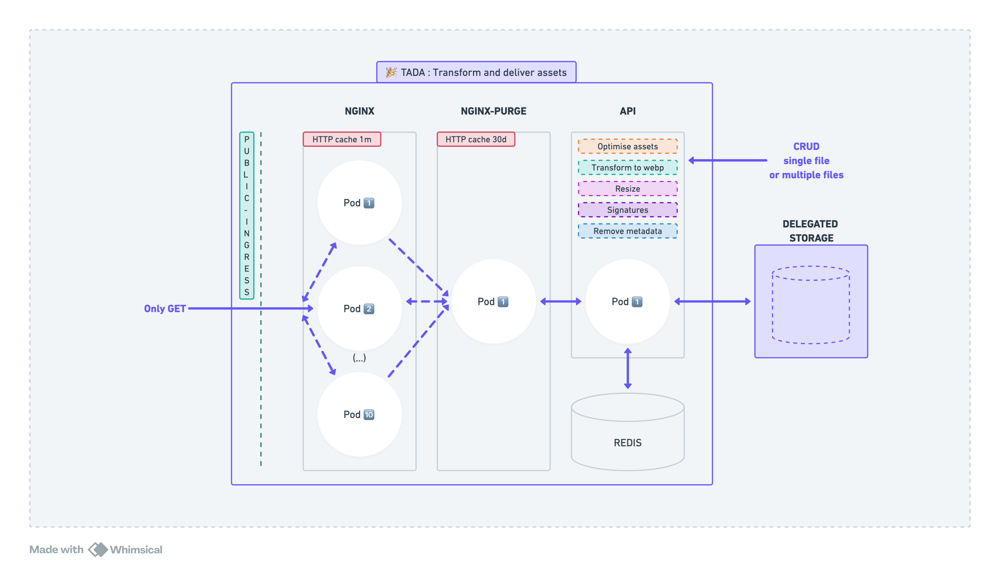
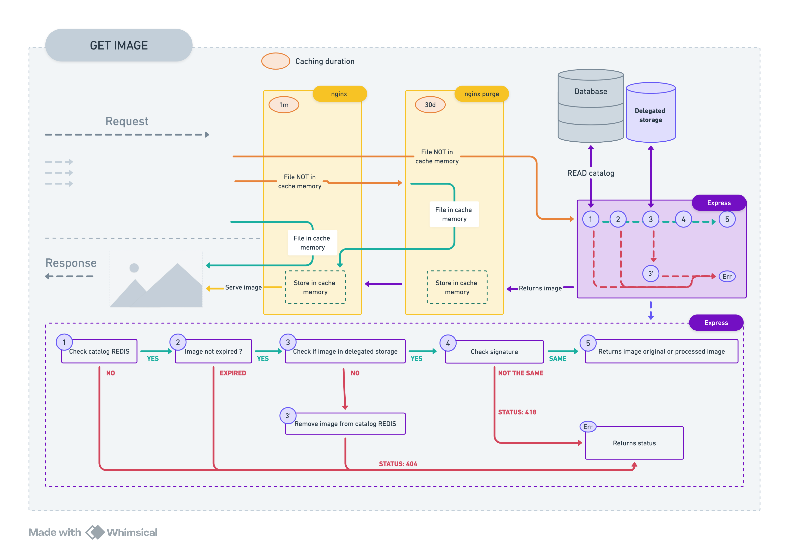
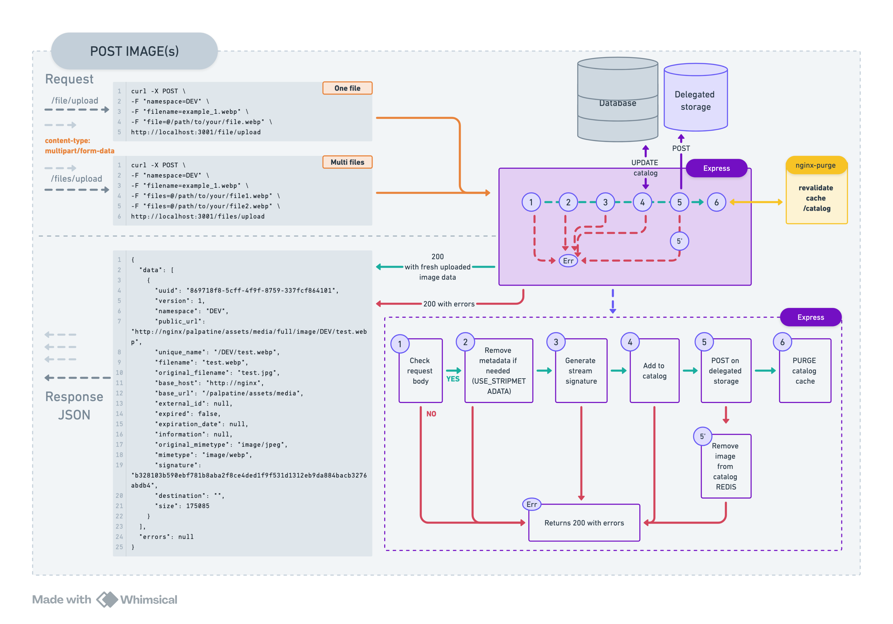
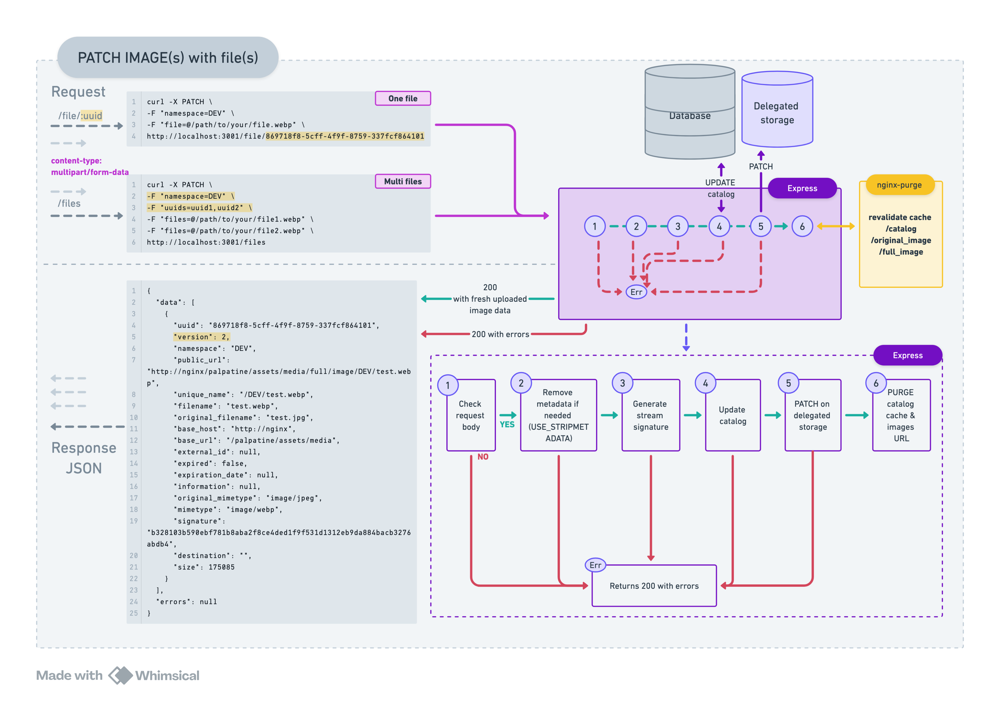
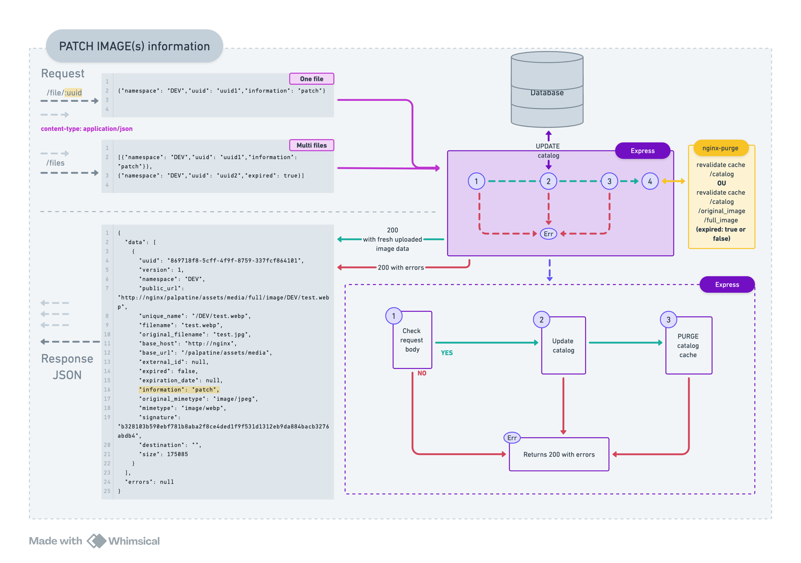
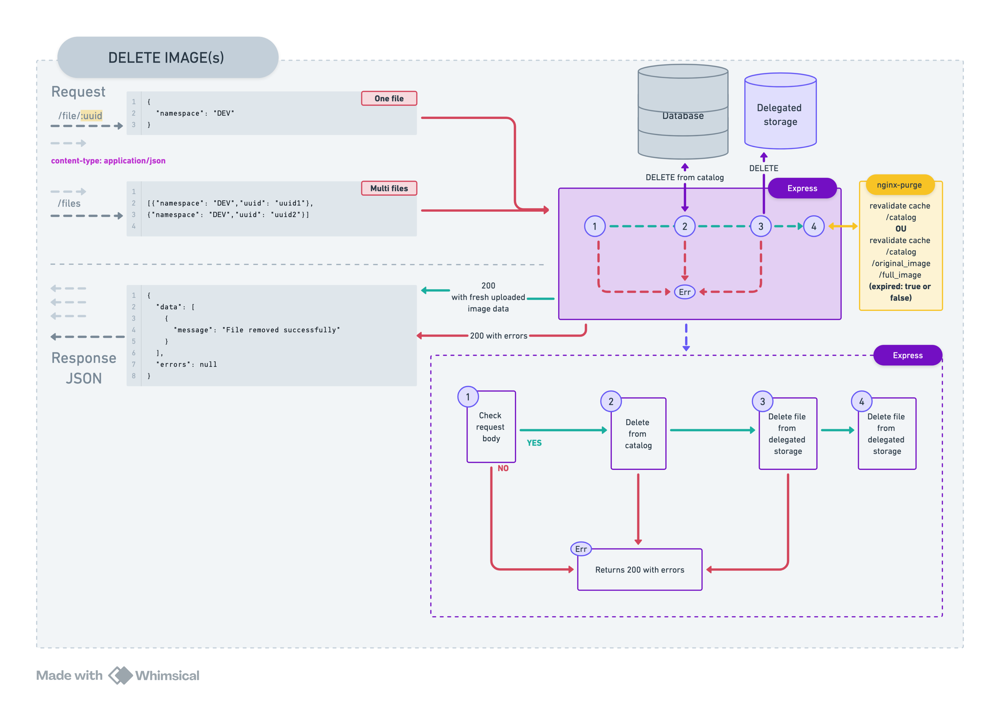

<a id="readme-top"></a>

# Transform And Deliver Assets - TADA 🎉

<details>
  <summary>Table of Contents</summary>
  <ol>
    <li>
      <a href="#discover-TADA">Discover TADA 🎉</a>
      <ul>
        <li><a href="#context">Context </a></li>
        <li><a href="#project-structure-and-architecture">Project structure and architecture 🚧</a></li>   
        <li><a href="#global-flow-architecture">Global flow architecture</a></li>  
        <li><a href="#use-cases">Use cases</a></li>  
        <li><a href="#catalog">Catalog</a></li>  
        <li><a href="#daily-jobs">Daily jobs</a></li>  
    </ul>
    </li>
    <li>
      <a href="#getting-started">Getting Started</a>
      <ul>
        <li><a href="#prerequisites">Prerequisites</a></li>
        <li><a href="#installation">Installation</a></li>
      </ul>
    </li>
    <li><a href="#usage">Usage</a></li>
    <li><a href="#roadmap">Roadmap</a></li>
    <li><a href="#contributing">Contributing</a></li>
    <li><a href="#license">License</a></li>
    <li><a href="#contact">Contact</a></li>
    <li><a href="#acknowledgments">Acknowledgments</a></li>
  </ol>
</details>

## Discover TADA

### Context

The image service allows any utils service to send files to be publicly hosted. Through an utils interface, such as
Directus for example, a user can utils an image and obtain a public URL to use to access their file.
The user can either use the original image via a specific URL or process the image through Thumbor for optimization.

### Project structure and architecture

To access the **API documentation** run at the root of the project :
```
npm run dev:api
```
Then go to :
```
http://localhost:3001/api-docs/
```

The image service (more generally files) consists of a first Nginx server whose configuration contains 3 types of locations:

-   /catalog
-   /assets/media/\*
-   /purge/assets/media/\*

This first web server is caching resource 1m,
then proxy pass to the nginx purge server that contains the same locations but configured with proxy_purge_module.
This server caching 30d and can invalidate cache with purge location.

To retrieve an uploaded file, 3 ways :

-   /assets/media/**original**/`image_name.extension` : no processing on the image
-   /assets/media/**full**/`image_name.extension` : transform to webp and serve as webp
-   /assets/media/**optimise**/200x0/`image_name.extension` : resizing to with 200 and transform to webp and serve as webp

And finally an Express Node API whose roles are:

-   providing the list of files exposed by the catalog/reference on a GET route
-   uploading new files
-   updating existing files

An important point is also the notion of catalog. The catalog serves as a reference & truth for the express API, the image can be accessible on glutton, or in the PV but contains information indicating not to serve it (either it has been deleted from the catalog, or it has expired for example).

### Global flow architecture



### Use cases







### Catalog

To track the images that we have uploaded/deleted/updated we use a Redis server and serve catalog list to json format. Here's a glimpse of it's
structure:

```json
[
    {
        "uuid": "e080a953-5300-427b-bd39-6e235d8238a2",
        "version": 1,
        "namespace": "DEV",
        "public_url": "http://localhost:8080/palpatine/assets/media/full/image/DEV/default.webp",
        "unique_name": "/DEV/default.webp",
        "filename": "default.webp",
        "original_filename": "default.webp",
        "base_url": "http://localhost:8080/palpatine/assets/media",
        "external_id": null,
        "expired": false,
        "expiration_date": null,
        "information": null,
        "original_mimetype": "image/webp",
        "mimetype": "image/webp",
        "signature": "ca71754acda70e41cb23e465fbb5ecc683186cf779a2bae2cbf290527b1f6671",
        "size": 16730
    },
    {
        "uuid": "d26a191f-1087-4169-b6cd-3db96f38ece4",
        "version": 1,
        "namespace": "DEV",
        "public_url": "http://localhost:8080/palpatine/assets/media/full/image/DEV/error.webp",
        "unique_name": "/DEV/error.webp",
        "filename": "error.webp",
        "original_filename": "error.webp",
        "base_url": "http://localhost:8080/palpatine/assets/media",
        "external_id": null,
        "expired": false,
        "expiration_date": null,
        "information": null,
        "original_mimetype": "image/webp",
        "mimetype": "image/webp",
        "signature": "368ba95afb311edfe0cb7f3b4a221e8b2a3edeb4e16fc5683762791f9619b28a",
        "size": 10614
    }
]
```

### Daily jobs

2 daily jobs associated with TADA (Transform And Deliver Assets 🎉):

-   a job to synchronize the state of our API in relation to YOUR delegated_storage: if the image is in the catalog, but not in your storage, it deletes the image from the catalog.
-   a catalog publication job on your delegated storage: the status of the catalog once a day is published on your storage which allows you to retrieve the most up-to-date list in the event of a new API instance.

<!-- GETTING STARTED -->

### Installation

1. Clone the repo
    ```sh
    git clone https://github.com/BouyguesTelecom/TADA.git
    ```
2. Install NPM packages
    ```sh
   cd src/api
    npm install
    ```
3. Setup your .env by running
    ```sh
    npm run decrypt-env
    ```

4. Change git remote url to avoid accidental pushes to base project
    ```sh
    git remote set-url origin github_username/repo_name
    git remote -v # confirm the changes
    ```

<p align="right">(<a href="#readme-top">back to top</a>)</p>

<!-- CONTRIBUTING -->

## Contributing

Contributions are what make the open source community such an amazing place to learn, inspire, and create. Any contributions you make are **greatly appreciated**.

If you have a suggestion that would make this better, please fork the repo and create a pull request. You can also simply open an issue with the tag "enhancement".
Don't forget to give the project a star! Thanks again!

1. Fork the Project
2. Create your Feature Branch (`git checkout -b feature/AmazingFeature`)
3. Commit your Changes (`git commit -m 'Add some AmazingFeature'`)
4. Push to the Branch (`git push origin feature/AmazingFeature`)
5. Open a Pull Request

<p align="right">(<a href="#readme-top">back to top</a>)</p>

<!-- LICENSE -->

## License

Distributed under the MIT License. See `LICENSE.txt` for more information.

<p align="right">(<a href="#readme-top">back to top</a>)</p>

<!-- CONTACT -->

## Contact

Project Link: [https://github.com/](https://github.com/BouyguesTelecom/TADA/tree/main)

<p align="right">(<a href="#readme-top">back to top</a>)</p>

<p align="right">(<a href="#readme-top">back to top</a>)</p>
